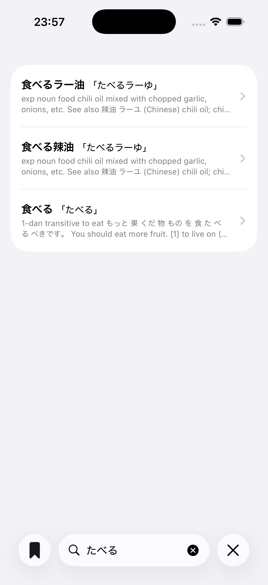
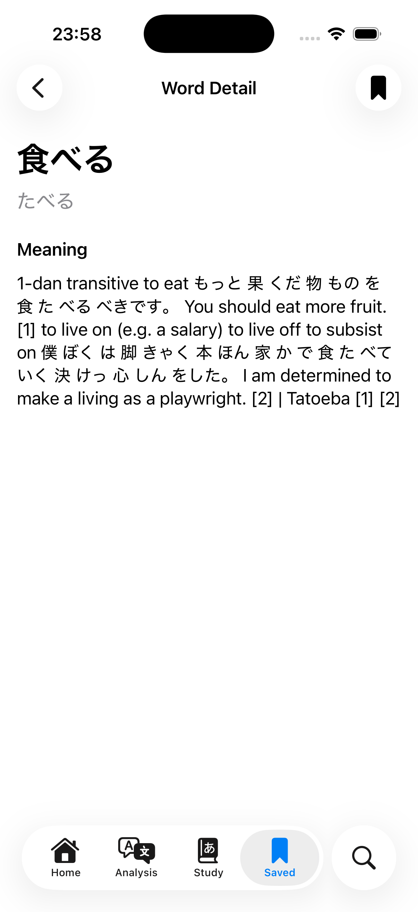
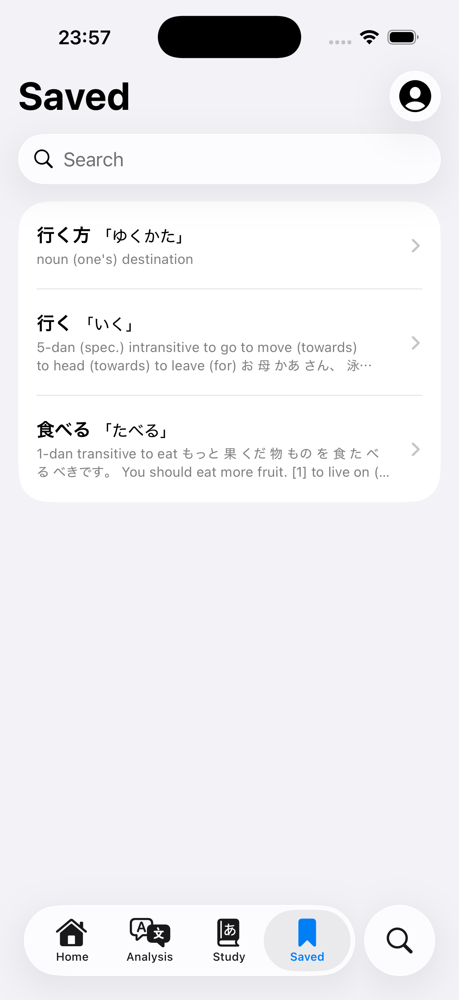
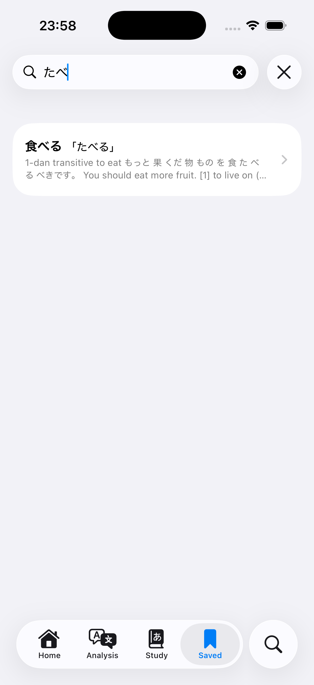

# KotobaLab

## !WIP!

A Japanese vocabulary app built with SwiftUI.

KotobaLab (placeholder name) allows users to search words, view detailed meanings, and save words for later review.

## Screenshots

> Current UI is a minimal MVP version. Further UI/UX improvements are planned.

| Search | Detail |
|-------|--------|
|  |  |

| Saved | Saved Search |
|------|--------------|
|  |  |

## Features

- Search words from a local dictionary
- View detailed word meanings
- Save / unsave words
- Browse saved words
- Search within saved words

## Architecture

The app follows a layered architecture:

- **Repository Layer**
  - `DictionaryRepository` (SQLite-based)
  - `UserDataRepository` (SwiftData-based)

- **Scene Layer**
  - Responsible for dependency injection and feature assembly

- **Store Layer**
  - Manages state using an observable pattern
  - Uses enum-based state modeling

- **View Layer**
  - Pure SwiftUI views
  - Driven by state
  - No direct dependency on repositories
  
## Data Flow

Search → Word Detail → Save → Saved List → Word Detail

The app forms a complete data loop:
- Words are fetched from a dictionary database
- Saved state is persisted locally using SwiftData
- Saved words are reloaded and displayed in the Saved screen

## Tech Stack

- SwiftUI
- SwiftData
- SQLite
- Swift Concurrency (basic usage)

## Notes

- Navigation is handled via Scene-level composition
- Views receive dependencies via closures instead of direct injection
- State is modeled using enums for clarity and safety
