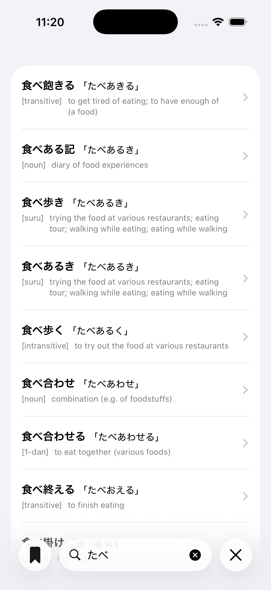
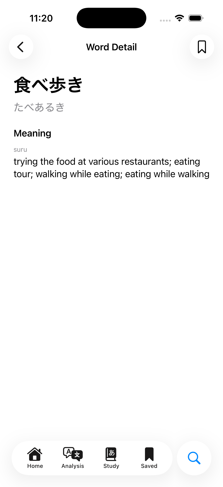
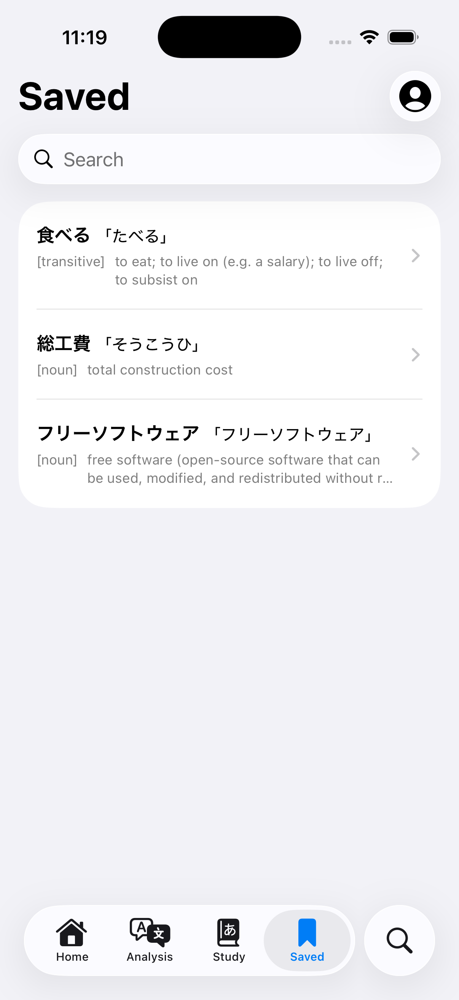
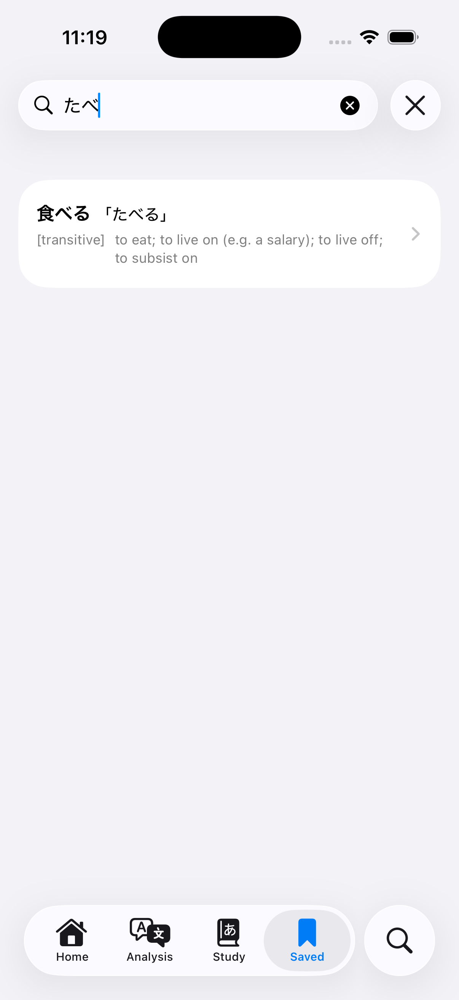

<h1 align="center">KotobaLab</h1>

<p align="center">
  A local-first Japanese dictionary and study app for iOS, built in SwiftUI.
</p>

<p align="center">
  <a href="https://github.com/shiinayane/KotobaLab/actions/workflows/ios-tests.yml"></a>
  <a href="https://github.com/shiinayane/KotobaLab/actions/workflows/builder-tests.yml"></a>
  
  
  <a href="LICENSE"></a>
  
</p>

> [!NOTE]
> KotobaLab is a personal project in active development. The MVP architecture and CI foundation are complete. See [Current Work](docs/development/current_work.md) for the active objective and [Product Roadmap](docs/roadmap/product_roadmap.md) for long-term direction.

The dictionary ships as a bundled, indexed SQLite asset — **293,471 entries in 52 MB** — for sub-millisecond offline prefix search. User data lives in a separate SwiftData store. The product direction prioritizes dictionary fidelity, stable identity, search quality, update safety, and daily usability before backend, AI, or broad study features.

> [!WARNING]
> The current asset is an MVP projection, not a source-complete dictionary model: distinct glosses are flattened into one meaning, extracted alternative forms are not stored, and saved data still references rebuild-dependent SQLite IDs. See the [Dictionary Strategy](docs/dictionary/strategy.md).

## Screenshots

> Minimal MVP UI. Core-loop states and polish landed in Phase 2.

<p align="center">
  <table>
    <tr>
      <td></td>
      <td></td>
      <td></td>
      <td></td>
    </tr>
    <tr align="center">
      <td>Search</td>
      <td>Word Detail</td>
      <td>Saved</td>
      <td>Saved Search</td>
    </tr>
  </table>
</p>

## Highlights

- **Offline-first dictionary.** 293,471 entries derived from JMdict via jitendex-yomitan; prefix search resolves to a verified `MULTI-INDEX OR` plan over `idx_words_term` + `idx_words_reading` and benchmarks at ~0.03 ms after `PRAGMA case_sensitive_like = ON`.
- **Strict layered architecture.** `View → Store → UseCase → Repository protocol → Repository impl → SQLite / SwiftData`. `Domain/` has zero SwiftUI / SwiftData / GRDB imports; every PR is reviewed against this rule.
- **Two-engine persistence.** GRDB-backed SQLite for read-heavy reference content; SwiftData (`@Model SavedWordRecord` with `@Attribute(.unique)`) for user state. The two are never mixed in the same store.
- **Reproducible build pipeline.** Python 3.14 builder (`parse → transform → export_sqlite`) with a self-contained pytest suite running on every push and PR, hard-fail database verification (`verify_database.py`), and one-command release automation (`release_dictionary.sh`) publishing tagged assets to GitHub Releases.

## Tech Stack

| Layer              | Technology                                                                                     |
| ------------------ | ---------------------------------------------------------------------------------------------- |
| UI                 | SwiftUI · `@Observable` stores · iOS 26+                                                       |
| Dictionary storage | SQLite via [GRDB 7](https://github.com/groue/GRDB.swift) (`upToNextMajorVersion` from `7.0.0`) |
| User-data storage  | SwiftData                                                                                      |
| Language           | Swift 6.0                                                                                      |
| Concurrency        | Swift Concurrency (`Task`, `Task.sleep`)                                                       |
| Tests              | Swift Testing (`@Test` / `#expect`) + pytest (Python pipeline)                                 |
| Build pipeline     | Python 3.14                                                                                    |
| CI                 | GitHub Actions — [`ios-tests.yml`](.github/workflows/ios-tests.yml) (xcodebuild) + [`builder-tests.yml`](.github/workflows/builder-tests.yml) (pytest) |
| Release            | Tagged GitHub Release artifact (build + verify + SHA-256 + `gh release create`)                |

## Getting Started

The dictionary database (`dictionary.sqlite`, ~52 MB) is **not** committed to git. It is published as a GitHub Release artifact.

```bash
# 1. Clone (HTTPS — works without SSH keys; substitute git@github.com:... if you have SSH set up)
git clone https://github.com/shiinayane/KotobaLab.git
cd KotobaLab

# 2. Download the dictionary from the latest release
curl -L -o KotobaLab/Resources/dictionary.sqlite \
  https://github.com/shiinayane/KotobaLab/releases/latest/download/dictionary.sqlite

# 3. (Optional) Verify the checksum
curl -L -o KotobaLab/Resources/dictionary.sqlite.sha256 \
  https://github.com/shiinayane/KotobaLab/releases/latest/download/dictionary.sqlite.sha256
( cd KotobaLab/Resources && shasum -a 256 -c dictionary.sqlite.sha256 )

# 4. Open in Xcode and build
open KotobaLab.xcodeproj
```

> [!IMPORTANT]
> Builder maintainers who need to regenerate the dictionary from source data do **not** follow this flow — see [For Maintainers](#for-maintainers).

## Architecture

```text
App / Scene
  └─ Feature View         (SwiftUI, pure render)
      └─ Store            (@MainActor @Observable)
          └─ UseCase      (business operation)
              └─ Repository protocol   ──┐  Domain (framework-free)
                  └─ Repository impl   ──┤
                      ├─ SQLite / GRDB ──┤  Data (concrete persistence)
                      └─ SwiftData     ──┘
```

Hard rules — surfaced in every review:

- `Domain/` cannot import SwiftUI, SwiftData, GRDB, or SQLite row types.
- Views cannot directly hold a Repository or database reference.
- Each feature uses the `Scene + Store + View` triad.
- Dictionary content (SQLite) and user data (SwiftData) never mix.

Detail: [`docs/architecture/overview.md`](docs/architecture/overview.md).

## Repository Layout

```text
KotobaLab/
├── App/                 KotobaLabApp, AppDependencies, TabContainer
├── Domain/              Entities, Repository protocols, UseCases (framework-free)
├── Data/                GRDB / SwiftData implementations + Mocks
├── Features/            Search, WordDetail, Saved, ... (Scene + Store + View triads)
├── Navigation/          AppRouter, AppRoute, AppSheet
├── Shared/              Shared SwiftUI components
└── Resources/           dictionary.sqlite (gitignored, see Getting Started)

KotobaLabTests/          Swift Testing — UseCase + Repository tests + fixture DB
Tools/DictionaryBuilder/ Python pipeline (parse / transform / export_sqlite + pytest)
Tools/scripts/           release_dictionary.sh
docs/                    English project docs (product / architecture / dictionary / roadmap / phases)
.github/workflows/       ios-tests.yml (xcodebuild) · builder-tests.yml (pytest) — on relevant push / PR
```

## For Maintainers

<details>
<summary><b>Run the iOS test suite</b></summary>

```bash
xcodebuild test \
  -project KotobaLab.xcodeproj \
  -scheme KotobaLab \
  -destination 'platform=iOS Simulator,name=iPhone 17' \
  -derivedDataPath /tmp/KotobaLabReviewDerived
```

</details>

<details>
<summary><b>Re-generate dictionary.sqlite locally</b></summary>

```bash
python3 Tools/DictionaryBuilder/main.py \
  --source dataset/source/jitendex-yomitan \
  --schema Tools/DictionaryBuilder/schema/dictionary_schema.sql \
  --output KotobaLab/Resources/dictionary.sqlite

python3 Tools/DictionaryBuilder/debug/verify_database.py \
  --db KotobaLab/Resources/dictionary.sqlite
```

</details>

<details>
<summary><b>Run the builder pytest suite</b></summary>

```bash
cd Tools/DictionaryBuilder && python3 -m pytest
```

Self-contained — no source dataset or main database required.

</details>

<details>
<summary><b>Publish a new dictionary release</b></summary>

```bash
Tools/scripts/release_dictionary.sh dict-vYYYY.MM.DD
```

Wraps build + verify + SHA-256 + `gh release create` into one command. The artifact is published at <https://github.com/shiinayane/KotobaLab/releases>. See [`docs/dictionary/pipeline.md`](docs/dictionary/pipeline.md) for the full delivery contract.

</details>

## Roadmap

KotobaLab's durable directions are:

- a trustworthy dictionary foundation
- a complete daily lookup experience
- an extensible, source-aware dictionary ecosystem
- continuity and portability for user-owned data

The [Product Roadmap](docs/roadmap/product_roadmap.md) intentionally avoids
status and task tracking. See [Current Work](docs/development/current_work.md)
for the immediate objective and [Phase Records](docs/phases/README.md) for
execution evidence.

## Documentation

| Topic | Document |
| --- | --- |
| Documentation entry point | [`docs/README.md`](docs/README.md) |
| Product definition and v1 gate | [`product_contract.md`](docs/product/product_contract.md) |
| Current objective and next action | [`current_work.md`](docs/development/current_work.md) |
| Engineering workflow | [`engineering_workflow.md`](docs/development/engineering_workflow.md) |
| Architecture | [`overview.md`](docs/architecture/overview.md) |
| Dictionary data direction | [`strategy.md`](docs/dictionary/strategy.md) |
| Build pipeline and delivery | [`pipeline.md`](docs/dictionary/pipeline.md) |
| Long-term roadmap | [`product_roadmap.md`](docs/roadmap/product_roadmap.md) |
| Phase plans and records | [`phases/README.md`](docs/phases/README.md) |
| Historical v1 audit | [`v1_gap_analysis.md`](docs/product/v1_gap_analysis.md) |

## Attribution

KotobaLab ships derivative dictionary data from:

- [JMdict](https://www.edrdg.org/jmdict/j_jmdict.html) — the Japanese–Multilingual Dictionary maintained by the [Electronic Dictionary Research and Development Group](https://www.edrdg.org/).
- [jitendex-yomitan](https://github.com/stephenmk/jitendex) — Stephen Kraus' JMdict-derived Yomitan dictionary.

The shipped `dictionary.sqlite` is licensed under **CC BY-SA 4.0**, inheriting from upstream. This attribution also surfaces in-app under **Settings → License**.

## License

The application source code is licensed under the [MIT License](LICENSE) — you are free to use, modify, and distribute it, subject to the terms in `LICENSE`.

The shipped dictionary asset (`dictionary.sqlite`, published via GitHub Releases) is **independently licensed under CC BY-SA 4.0** and inherits the attribution and share-alike requirements of its upstream sources. The MIT license on the source code does not waive those requirements. See [Attribution](#attribution) for details.
